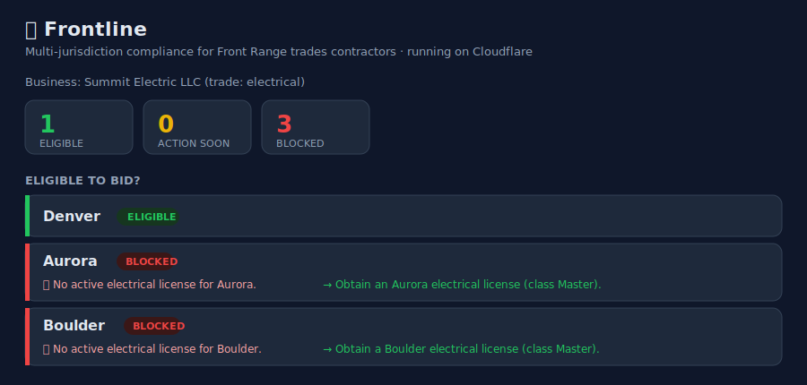

# 🏗️ Frontline

**Multi-jurisdiction license, insurance & permit compliance command center for
Front Range (Denver-metro) trades contractors — built entirely on Cloudflare.**

One screen answers the question that costs contractors real money:

> *"Am I legal to bid in this city today — and what lapses in the next 60 days
> across every jurisdiction I work in?"*



---

## Why this exists

Colorado has **no statewide general-contractor license**. Every municipality runs
its own license class, exam, fees, insurance minimums, and renewal cycle — with
almost no reciprocity. A contractor working Denver, Aurora, Lakewood, and Boulder
is juggling four independent compliance regimes, each with its own deadlines and
penalties. (See [`docs/01-research-synthesis.md`](docs/01-research-synthesis.md)
for how four research agents converged on this as *the* distinctive, scalable
Denver pain point — the same fragmentation drives local-wage and home-rule-tax
pain too.)

Existing tools track *GCs' subcontractor COIs* or do dumb expiry reminders.
**Nobody owns the contractor-facing jurisdiction-rules database.** Frontline does.

## What it does

- **City-by-city eligibility grid** — green / yellow / red per jurisdiction, each
  cell carrying the *specific blocker and the fix* ("Aurora requires a Master
  electrical license — obtain one"; "GL is $500K, Denver requires $1M").
- **Business → qualifier → license** model that matches how trades actually hold
  credentials (a person qualifies the firm).
- **Granular insurance checks** — per-occurrence vs aggregate limits, workers'
  comp, additional-insured endorsement.
- **Reciprocity** — recognizes when one city accepts another's license.
- **Grace periods** — honest near-expiry eligibility.
- **Proactive alerts** — a daily scan finds lapsing/overdue credentials and fans
  them out through a queue to a (pluggable) notifier.
- **Document vault** — license & COI PDFs stored in R2 and linked to each record.
- **Trust by design** — every jurisdiction rule carries a `source_url` and
  `verified_on` date, surfaced in the UI with a disclaimer.

## Architecture — 100% Cloudflare

| Capability | Primitive | Where |
|------------|-----------|-------|
| API + routing | **Workers** (Hono) | `src/index.ts` |
| Relational data | **D1** (SQLite) | `migrations/`, `src/db.ts` |
| Cached rule lookups | **KV** | `src/index.ts` (`/api/jurisdictions`) |
| License/COI PDFs | **R2** | `src/index.ts` (`/api/documents/*`) |
| Daily deadline scan | **Cron Triggers** | `scheduled()` → `src/scan.ts` |
| Alert fan-out | **Queues** (producer + consumer) | `src/scan.ts`, `queue()` |
| Dashboard | **Workers Assets** | `public/index.html` |

The **compliance engine** (`src/compliance.ts`) is pure and deterministic — no
I/O — so it is exhaustively unit-tested and runs at the edge with zero latency.

## Quick start (≈2 minutes, no Cloudflare account needed)

```bash
cd frontline-compliance
npm install
npm run db:migrate     # applies schema + story-driven seed to a LOCAL D1
npm run dev            # wrangler dev — simulates D1/KV/R2/Queues locally
```

Open **http://localhost:8787**. The dashboard opens on a fully-populated business.
Switch between the four seeded demo businesses to see every state:

| Business | Trade | What it shows |
|----------|-------|---------------|
| **Summit Electric LLC** | electrical | ✅ Eligible in Denver, ⛔ blocked elsewhere (no local license) |
| **Front Range Mechanical** | hvac | 🟡 Eligible in Denver but GL COI lapses in ~12 days |
| **Bluebird Roofing Co** | roofing | ⛔ Lakewood license already lapsed (overdue) |
| **Cornerstone Builders** | general | ↔ Eligible in Wheat Ridge **via reciprocity** on its Denver license |

Click **"▶ Run alert scan now"** to trigger the deadline scan; enqueued alerts are
persisted to D1 and printed by the queue consumer's `ConsoleNotifier` in the
`wrangler dev` logs.

> Or just `npm run demo` (migrate + dev in one command).

## Test

```bash
npm test        # pure compliance-engine unit tests (12 cases)
npm run typecheck
```

## Deploy to Cloudflare

```bash
# Create the resources, then paste the IDs into wrangler.jsonc:
npx wrangler d1 create frontline-db
npx wrangler kv namespace create RULES_CACHE
npx wrangler r2 bucket create frontline-docs
npx wrangler queues create frontline-alerts

npx wrangler d1 migrations apply frontline-db --remote
npx wrangler deploy
```

Swap `ConsoleNotifier` for the example `ResendNotifier` in `src/notifier.ts` (and
add an API key as a secret) to send real email.

## API

| Method | Path | Purpose |
|--------|------|---------|
| GET | `/api/health` | liveness |
| GET | `/api/businesses` | list businesses |
| POST | `/api/businesses` | create a business |
| **GET** | **`/api/businesses/:id/compliance`** | **the eligibility grid + upcoming-expiry rollup** |
| GET | `/api/jurisdictions` | jurisdiction rules (KV-cached) |
| PUT | `/api/documents/:entityType/:entityId` | upload a license/COI PDF to R2 |
| GET | `/api/documents/*` | fetch a stored document |
| POST | `/api/scan` | trigger the deadline scan (same path as cron) |

## How it was built

This repo is the deliverable of an **agent-orchestrated** process: parallel
research agents found the pain point, an orchestrator selected and planned the
solution, and a **product-manager agent ran a two-round feedback loop** on the
plan and the built artifact. The full paper trail is in [`docs/`](docs/):

1. `01-research-synthesis.md` — cross-sector pain-point research
2. `02-decision-record.md` — why this solution was selected
3. `03-pm-feedback-log.md` — the PM feedback loop (both rounds)
4. `04-implementation-plan.md` — the plan
5. `05-build-vs-feedback.md` — how each PM must-fix was resolved

## Status & honest limits

This is a **reference build**, not a production product. Jurisdiction rules are
illustrative/simplified (real ones must be sourced and maintained — that's the
moat *and* the operational work). No money movement, no PHI, no real e-filing.
The roadmap extends the same jurisdiction-rules + deadline engine to local-wage
and home-rule-tax compliance.

## License

MIT
